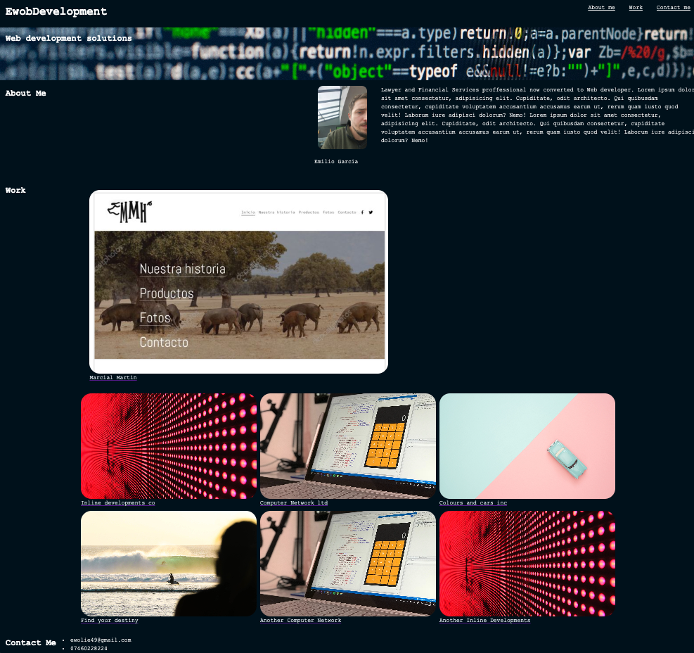

# EwobDevelopment

Project to create my first portfolio page

You can find the page here: https://ewolie49.github.io/EwobDevelopment/

## Description

The aim of this project is to create a portfolio to showcase my work.

Having a portofolio page with links to my live application is a good way to showcase my job.
It´s also a really good opportunity to put into practice some of the skills learned during the first two weeks of the bootcamp.
It has been a good opportunity to gain a better of understanding of flexbox as well as media queries.
It has been quite challenging as the page was not always behaving in the way that I wanted but after trial and error and quite a lot of research I am happy that I have managed to create a basic page.
I will definetively keep working on this page with the intention of making it better.

## Usage
The portfolio page consists of a single page. It has a nav menu at the top of the page that will link you to the relevant sections.
If you hover the images, a shadow will show and the mouse icon will change into a hand showing that you can interact with it.
Given I do not have exsiting pages, I have just added a link to google.co.uk to show how it would work. Once I have more pages I will update both the pages and the links.

## Credits

I took advantage of two tutoring sessions for this challenge.
First session I had it with Joem Casusi and we work together on some of the flexbox functionallity to make it more responsive.
Second session I had it with Juan Delgado who guided me on how to better use media queries.

